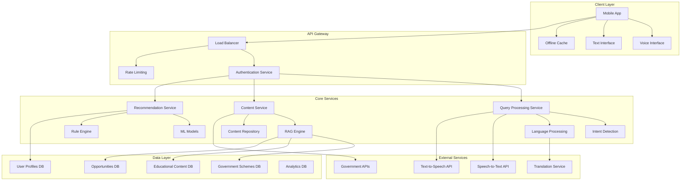

# Design Document: AI-Powered Community Access Platform

## Overview

The AI-Powered Community Access Platform is designed as a voice-first, multilingual system that democratizes access to public information and opportunities for underserved communities in Bharat. The platform leverages modern AI technologies including Retrieval-Augmented Generation (RAG), natural language processing, and hybrid recommendation systems to provide an intuitive, accessible interface for citizens with varying levels of digital literacy.

The system architecture prioritizes offline-first capabilities, low-bandwidth optimization, and regional language support to ensure reliable access in resource-constrained environments. The design emphasizes simplicity, privacy, and community-scale impact while maintaining the flexibility to scale across different regions and contexts.

**Prototype Focus:**
- Voice-based scheme discovery in Hindi and Tamil (MVP languages)
- RAG-powered eligibility explanation using pre-loaded government scheme dataset
- Basic offline access to top-priority government schemes and emergency information
- Simple rule-based recommendations (ML training loop in post-hackathon roadmap)
- Minimal web UI for demo purposes

## Architecture

### High-Level System Architecture



### Microservices Architecture

The platform follows a microservices architecture with the following core services. For the hackathon prototype, core services may be deployed as modular components within a single backend, while retaining logical service boundaries for future scalability:

1. **API Gateway Service**: Handles routing, authentication, rate limiting, and load balancing
2. **Query Processing Service**: Manages voice/text input, intent detection, and language processing
3. **Content Service**: Implements RAG for content retrieval and manages the knowledge base
4. **Recommendation Service**: Provides personalized suggestions using hybrid ML and rule-based approaches
5. **User Management Service**: Handles user profiles, preferences, and privacy settings
6. **Analytics Service**: Tracks usage patterns and system performance for continuous improvement
7. **Notification Service**: Manages alerts and updates for relevant opportunities

## Components and Interfaces

### Voice Interface Component

The voice interface serves as the primary interaction method, designed for users with limited literacy:

**Core Functionality:**
- Real-time speech-to-text conversion in Hindi and Tamil (MVP languages)
- Context-aware intent detection for natural language queries
- Text-to-speech response generation with regional accent support
- Noise reduction and audio quality optimization for mobile devices
- Caching of frequent queries and pre-translated summaries for common schemes to minimize latency

**Interface Specifications:**
```typescript
interface VoiceInterface {
  startListening(): Promise<void>
  stopListening(): Promise<string>
  processAudio(audioData: ArrayBuffer): Promise<TranscriptionResult>
  synthesizeSpeech(text: string, language: Language): Promise<AudioBuffer>
  detectIntent(transcription: string): Promise<Intent>
}

interface TranscriptionResult {
  text: string
  confidence: number
  language: Language
  duration: number
}
```

### RAG Engine Component

The Retrieval-Augmented Generation engine provides intelligent content discovery and response generation:

**Core Functionality:**
- Vector-based semantic search over pre-loaded government schemes dataset
- Context-aware content retrieval with relevance scoring
- Multi-language content generation for Hindi and Tamil
- Basic content indexing and validation (real-time updates in post-hackathon roadmap)

**Interface Specifications:**
```typescript
interface RAGEngine {
  indexContent(content: ContentItem[]): Promise<void>
  searchContent(query: string, context: UserContext): Promise<SearchResult[]>
  generateResponse(query: string, retrievedContent: ContentItem[]): Promise<string>
  updateIndex(contentId: string, newContent: ContentItem): Promise<void>
}

interface SearchResult {
  content: ContentItem
  relevanceScore: number
  explanation: string
}
```

### Recommendation Engine Component

The hybrid recommendation system combines rule-based logic with machine learning:

**Core Functionality:**
- Profile-based filtering using demographic and geographic rules
- Simple content-based recommendations using scheme/opportunity attributes  
- Basic feedback collection system (ML learning loop in post-hackathon roadmap)
- Rule-based recommendation explanations
- Periodic evaluation of recommendation outputs to avoid systematic exclusion based on language, gender, or income proxies

**Interface Specifications:**
```typescript
interface RecommendationEngine {
  getRecommendations(userId: string, context: RecommendationContext): Promise<Recommendation[]>
  updateUserFeedback(userId: string, itemId: string, feedback: Feedback): Promise<void>
  trainModel(trainingData: UserInteraction[]): Promise<ModelMetrics>
  explainRecommendation(recommendationId: string): Promise<Explanation>
}

interface Recommendation {
  item: ContentItem
  score: number
  reasoning: string
  category: RecommendationType
}
```

### Offline Cache Component

The offline cache ensures critical functionality during connectivity issues:

**Core Functionality:**
- Essential content prioritization for local storage
- Basic cache compression and storage optimization
- Simple cache management without conflict resolution (MVP scope)
- Basic synchronization when connectivity resumes (full differential sync in post-hackathon roadmap)

**Interface Specifications:**
```typescript
interface OfflineCache {
  cacheContent(content: ContentItem[], priority: CachePriority): Promise<void>
  getCachedContent(query: string): Promise<ContentItem[]>
  syncWithServer(): Promise<SyncResult>
  clearCache(olderThan: Date): Promise<void>
}

interface SyncResult {
  itemsUpdated: number
  itemsAdded: number
  itemsRemoved: number
  syncTimestamp: Date
}
```

## Data Models

### User Profile Model

```typescript
interface UserProfile {
  id: string
  demographics: {
    age: number
    gender: Gender
    location: Location
    education: EducationLevel
    occupation: string
    income: IncomeRange
  }
  preferences: {
    primaryLanguage: Language
    secondaryLanguages: Language[]
    interactionMode: InteractionMode
    notificationSettings: NotificationPreferences
  }
  history: {
    queries: QueryHistory[]
    accessedSchemes: string[]
    completedActions: UserAction[]
  }
  privacy: {
    dataConsent: ConsentSettings
    profileVisibility: VisibilityLevel
    dataRetention: RetentionSettings
  }
}
```

### Content Item Model

```typescript
interface ContentItem {
  id: string
  type: ContentType
  title: string
  description: string
  content: {
    summary: string
    details: string
    eligibility: EligibilityCriteria[]
    applicationProcess: ProcessStep[]
    requiredDocuments: Document[]
  }
  metadata: {
    source: string
    lastUpdated: Date
    language: Language
    region: string[]
    category: string[]
    tags: string[]
  }
  accessibility: {
    readingLevel: ReadingLevel
    audioAvailable: boolean
    visualAids: string[]
  }
}
```

### Query and Intent Models

```typescript
interface UserQuery {
  id: string
  userId: string
  timestamp: Date
  input: {
    text: string
    audio?: AudioData
    language: Language
    inputMethod: InputMethod
  }
  processing: {
    intent: Intent
    entities: Entity[]
    confidence: number
    processingTime: number
  }
  response: {
    content: string
    audio?: AudioData
    recommendations: string[]
    followUpSuggestions: string[]
  }
}

interface Intent {
  category: IntentCategory
  action: string
  parameters: Record<string, any>
  confidence: number
}
```

## Correctness Properties

*A property is a characteristic or behavior that should hold true across all valid executions of a system—essentially, a formal statement about what the system should do. Properties serve as the bridge between human-readable specifications and machine-verifiable correctness guarantees.*

**For the hackathon MVP, correctness properties 1–6, 8, 9, and 12 are enforced. Remaining properties define post-hackathon guarantees.**

Before defining the correctness properties, I need to analyze the acceptance criteria from the requirements to determine which ones are testable as properties.

### Property 1: Comprehensive Search and Filtering
*For any* user profile and search query, the platform should return results that match all applicable filter criteria including location, education level, skills, and user demographics
**Validates: Requirements 1.1, 2.1, 3.1**

### Property 2: Content Completeness and Structure
*For any* content item (scheme, job listing, educational resource), all required fields should be present and properly structured including application steps, required documents, eligibility criteria, and relevant metadata
**Validates: Requirements 1.3, 3.2, 3.4**

### Property 3: Personalized Recommendation Generation
*For any* user profile and context, recommendations should be relevant to the user's location, occupation, education level, and goals, with explanations provided for each suggestion
**Validates: Requirements 2.3, 7.1, 7.3, 7.5**

### Property 4: Multi-Language Voice Processing
*For any* voice input in supported languages (Hindi, Tamil), the platform should achieve 85% transcription accuracy and respond in the user's preferred language using RAG-retrieved content
**Validates: Requirements 4.2, 4.3, 4.4**

### Property 5: Offline Functionality and Synchronization
*For any* network connectivity state, the platform should provide appropriate functionality - full features when online, cached essential features when offline, and proper synchronization when connectivity is restored
**Validates: Requirements 5.1, 5.2, 5.3, 5.5**

### Property 6: Data Encryption and Privacy
*For any* user data (personal information, queries, preferences), the platform should encrypt data both in transit and at rest, and process deletion requests within 30 days
**Validates: Requirements 6.3, 6.4**

### Property 7: Learning and Adaptation
*For any* user interaction sequence, the platform should improve query understanding and recommendation accuracy over time, adapting to profile changes and user feedback
**Validates: Requirements 2.4, 7.2, 7.4**

### Property 8: Performance and Scalability
*For any* system load up to 1,000 concurrent users (MVP scope), the platform should be architected to maintain response times under 3 seconds and designed for 99% uptime availability during demonstration
**Validates: Requirements 9.1, 9.2, 9.3, 9.5**

### Property 9: User Experience and Accessibility
*For any* user interaction, the platform should enable information discovery within 3 interactions, provide clear navigation feedback, and offer helpful error messages with solutions
**Validates: Requirements 8.2, 8.3, 8.5**

### Property 10: Content Management and Updates
*For any* content update or import operation, the platform should validate content before publishing, maintain version history, notify affected users of changes, and support bulk imports from external sources
**Validates: Requirements 1.5, 10.1, 10.2, 10.3, 10.4, 10.5**

### Property 11: Notification and Alert System
*For any* new opportunity or content that matches user preferences, the platform should generate appropriate alerts and connect users with relevant training programs for identified skill gaps
**Validates: Requirements 3.3, 3.5**

### Property 12: Error Handling and Fallback Mechanisms
*For any* system failure or input processing error (voice recognition failure, network issues), the platform should provide appropriate fallback options and maintain system stability
**Validates: Requirements 4.5**

### Property 13: Consent and Data Collection
*For any* data collection operation, the platform should obtain explicit user consent with clear explanations before collecting personal information
**Validates: Requirements 6.2**

### Property 14: Content Organization and Discovery
*For any* educational content request, materials should be properly organized by skill level and subject area, with both formal and informal learning opportunities available
**Validates: Requirements 2.2, 2.5**

### Property 15: Bandwidth Optimization
*For any* data transfer operation, the platform should compress data to minimize bandwidth usage while maintaining functionality
**Validates: Requirements 5.4**

### Property 16: Community Deployment Adaptation
*For any* new community deployment, the platform should be designed to adapt to local context and requirements within 48 hours
**Validates: Requirements 9.4**

## Error Handling

The platform implements comprehensive error handling across all components to ensure graceful degradation and user-friendly error recovery:

### Voice Processing Errors
- **Speech Recognition Failures**: Automatic fallback to text input with visual prompts
- **Language Detection Errors**: Default to user's primary language with option to manually select
- **Audio Quality Issues**: Noise reduction algorithms with retry mechanisms

### Network and Connectivity Errors
- **Offline Mode Activation**: Automatic detection of connectivity loss with seamless cache activation
- **Partial Connectivity**: Adaptive content loading with priority-based data fetching
- **Sync Failures**: Queued operations with automatic retry and conflict resolution

### Content and Data Errors
- **Missing Content**: Graceful handling with alternative suggestions and user notification
- **Outdated Information**: Version checking with automatic updates and user alerts
- **Validation Failures**: Clear error messages with specific correction guidance

### System Performance Errors
- **High Load Conditions**: Auto-scaling with load balancing and request queuing
- **Service Unavailability**: Circuit breaker patterns with fallback services
- **Timeout Handling**: Progressive timeout strategies with partial result delivery

## Testing Strategy

The testing approach combines comprehensive unit testing with property-based testing to ensure system reliability and correctness across diverse usage scenarios.

### Unit Testing Approach

**Component-Level Testing:**
- Voice interface components: Test speech recognition accuracy, language detection, and audio processing
- RAG engine: Test content retrieval, relevance scoring, and response generation
- Recommendation engine: Test filtering logic, scoring algorithms, and explanation generation
- Offline cache: Test data synchronization, compression, and cache invalidation

**Integration Testing:**
- End-to-end user workflows: Test complete user journeys from voice input to content delivery
- Cross-service communication: Test API interactions between microservices
- External service integration: Test government API connections and third-party service reliability
- Multi-language processing: Test translation accuracy and language switching

**Edge Case Testing:**
- Network connectivity variations: Test behavior under poor, intermittent, and offline conditions
- Voice input quality: Test with background noise, accents, and speech variations
- Content edge cases: Test with missing data, malformed content, and large datasets
- User profile variations: Test with diverse demographic combinations and preference settings

### Property-Based Testing Configuration

**Testing Framework:** The platform will use Hypothesis (Python) for property-based testing with minimum 100 iterations per property test.

**Property Test Implementation:**
- Each correctness property will be implemented as a single property-based test
- Tests will generate random user profiles, queries, and system states
- All property tests will be tagged with: **Feature: community-access-platform, Property {number}: {property_text}**
- Property tests will focus on universal behaviors that must hold across all valid inputs

**Test Data Generation:**
- User profiles: Random demographics, locations, education levels, and preferences
- Queries: Natural language variations in supported languages with different intents
- Content items: Government schemes, educational resources, and opportunities with varied completeness
- System states: Different load conditions, connectivity states, and cache configurations

**Dual Testing Benefits:**
- Unit tests catch specific bugs and validate concrete examples
- Property tests verify universal correctness across infinite input combinations
- Together they provide comprehensive coverage ensuring both specific functionality and general system behavior

### Performance Testing

**Load Testing:**
- Concurrent user simulation up to 10,000 users
- Response time measurement under various load conditions
- Resource utilization monitoring and optimization

**Stress Testing:**
- System behavior under extreme load conditions
- Failure point identification and graceful degradation testing
- Recovery time measurement after system stress

**Accessibility Testing:**
- Voice interface testing with diverse accents and speech patterns
- Low-bandwidth simulation and optimization validation
- Multi-language accuracy and consistency testing

The testing strategy ensures that the platform meets its accessibility, performance, and reliability requirements while maintaining high-quality user experience across diverse usage scenarios and technical constraints.